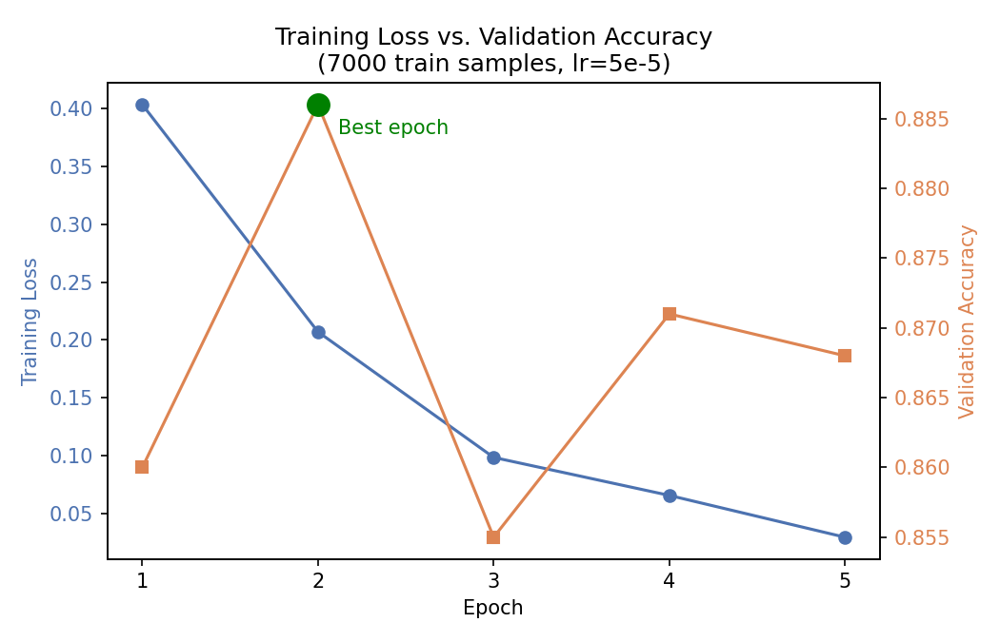

# Fine-Tuning BERT for IMDb Sentiment Classification

**Status:** Completed ✔️ | **Best Accuracy:** 87.2% | **Framework:** PyTorch + Hugging Face

This project fine-tunes the pretrained **bert-base-uncased** model on the **IMDb Movie Review** dataset for binary sentiment classification.

Instead of relying on Hugging Face's high-level `Trainer` API, the complete fine-tuning pipeline was implemented manually using **PyTorch** and **Hugging Face Transformers**, including tokenization, batching, optimization, validation, checkpoint selection, model saving, and final evaluation.

The primary goal of this project was to gain a practical understanding of **how transformer fine-tuning works internally** while investigating how different training decisions affect model performance.

---

## Best Result

| Model | Dataset | Test Accuracy |
|-------|---------|--------------:|
| bert-base-uncased | IMDb | **87.2%** |

### Classification Report

| Metric | Negative | Positive |
|---------|---------:|---------:|
| Precision | **0.87** | **0.88** |
| Recall | **0.88** | **0.86** |
| F1-score | **0.88** | **0.87** |

---

## Technologies

- Python
- PyTorch
- Hugging Face Transformers
- Hugging Face Datasets
- Scikit-learn
- Google Colab

---

## Project Structure

```text
bert-imdb-sentiment-classifier/
├── train.py
├── predict.py
├── requirements.txt
├── README.md
└── best_model/
```

---

## Training Pipeline

1. Load IMDb dataset
2. Tokenize movie reviews using the BERT tokenizer
3. Create PyTorch DataLoaders
4. Fine-tune BERT
5. Evaluate on the validation set after every epoch
6. Save the best validation checkpoint
7. Reload the best checkpoint
8. Evaluate on the unseen test set

---

## Training Curve



Training loss decreases steadily throughout training while validation accuracy reaches its highest value at **epoch 2** before beginning to decline.

Although optimization on the training data continues to improve, validation performance no longer improves after the second epoch, indicating the beginning of **overfitting**.

This experiment demonstrates why selecting the **best validation checkpoint** is preferable to simply using the final training epoch.

---

## Experiments

| Run | Train / Val / Test | Learning Rate | Epochs | Best Epoch | Best Validation Accuracy | Final Test Accuracy |
|----:|--------------------|--------------:|--------:|-----------:|-------------------------:|--------------------:|
| 1 | 3000 / 500 / 1000 | 5e-5 | 3 | — | 0.876 | 0.828 |
| 2 | 3000 / 500 / 1000 | 5e-5 | 3 | 2 | 0.888 | 0.852 |
| 3 | 3000 / 500 / 1000 | 5e-5 | 5 | 2 | 0.874 | 0.837 |
| 4 | 7000 / 1000 / 1000 | 5e-5 | 5 | 2 | 0.886 | **0.872** |
| 5 | 3000 / 500 / 1000 | 2e-5 | 5 | 4 | 0.878 | 0.844 |

---

## Key Findings

### Best Checkpoint Selection

Saving the best validation checkpoint increased test accuracy from **82.8%** to **85.2%** without changing the dataset or hyperparameters.

This demonstrates that the final epoch is not necessarily the best-performing model once overfitting begins.

### Dataset Size

Increasing the training dataset from **3,000** to **7,000** reviews produced the strongest overall performance, improving test accuracy to **87.2%** while maintaining balanced precision and recall across both classes.

Among all experiments, increasing the dataset size had the greatest positive impact.

### Learning Rate

Reducing the learning rate from **5e-5** to **2e-5**

- delayed overfitting,
- shifted the best checkpoint from epoch 2 to epoch 4,

but did **not** improve final test accuracy.

This experiment illustrates that a smaller learning rate does not necessarily produce better generalization.

### Overfitting

Across every experiment,

- training loss continued decreasing,
- validation accuracy peaked early,
- later epochs failed to improve generalization.

This consistent behavior highlights the importance of validation monitoring and checkpoint selection during transformer fine-tuning.

---

## Model Behavior & Limitations

Beyond reporting aggregate accuracy, I evaluated the model on a collection of manually designed edge cases to better understand **how it makes predictions**, not just **how often it is correct**.

### Negation

The model handled negated negative expressions (e.g., *"not very bad"*) more reliably than negated positive expressions (e.g., *"not very good"*). This behavior remained consistent across multiple adjective pairs (good/bad and happy/sad), suggesting a systematic weakness in handling certain forms of negation.

### Contrastive Sentences

For sentences containing the conjunction **"but"**, the model consistently placed greater emphasis on the clause that followed it. Examples:

- *"The movie was boring but excellent."* → Positive
- *"The movie was excellent but boring."* → Negative

Replacing **"but"** with **"however"** or separating the clauses with punctuation produced a noticeably weaker effect, suggesting that the model learned **"but"** as a particularly strong sentiment cue from the IMDb training data.

### Lexical Bias

Certain highly negative words—especially *"terrible"*—strongly influenced predictions regardless of sentence position or competing positive words. Other strong negative adjectives (e.g., *"atrocious"*) did not consistently display the same behavior, indicating that the model relies heavily on specific lexical cues rather than treating all negative words equally.

### Confidence Calibration

The model frequently assigned probabilities above **90%**, even for deliberately ambiguous or mixed-sentiment sentences. This suggests that its confidence estimates are not always well calibrated, likely due to binary training labels and the relatively small fine-tuning dataset.

### Overall Observation

Although the model achieved **87.2% test accuracy** on the IMDb benchmark, these experiments show that high aggregate performance does not necessarily imply robust language understanding. In the manually designed examples tested here, the model often relied on strong lexical and structural cues—such as specific words or the conjunction **"but"**—rather than consistently interpreting the full semantic context of a sentence. These observations complement the quantitative evaluation by highlighting behaviors that are not visible from accuracy metrics alone.

---

## Example Prediction

Input

```text
I absolutely loved this movie.
```

Prediction

```text
Positive (99.8%)
```

---

## Future Improvements

- Train on larger subsets (10k+ samples)
- Add a learning-rate scheduler (warmup + decay)
- Compare against DistilBERT
- Experiment with longer maximum sequence lengths
- Deploy an interactive Gradio demo on Hugging Face Spaces

---

## How to Run

```bash
pip install -r requirements.txt

python train.py
python predict.py
```

---

## Takeaways

This project was developed to build a practical understanding of transformer fine-tuning by implementing the complete training pipeline manually and evaluating the impact of different training decisions.

Rather than focusing only on maximizing accuracy, the project emphasizes understanding **why** checkpoint selection, dataset size, learning rate, and validation strategy influence model generalization.
